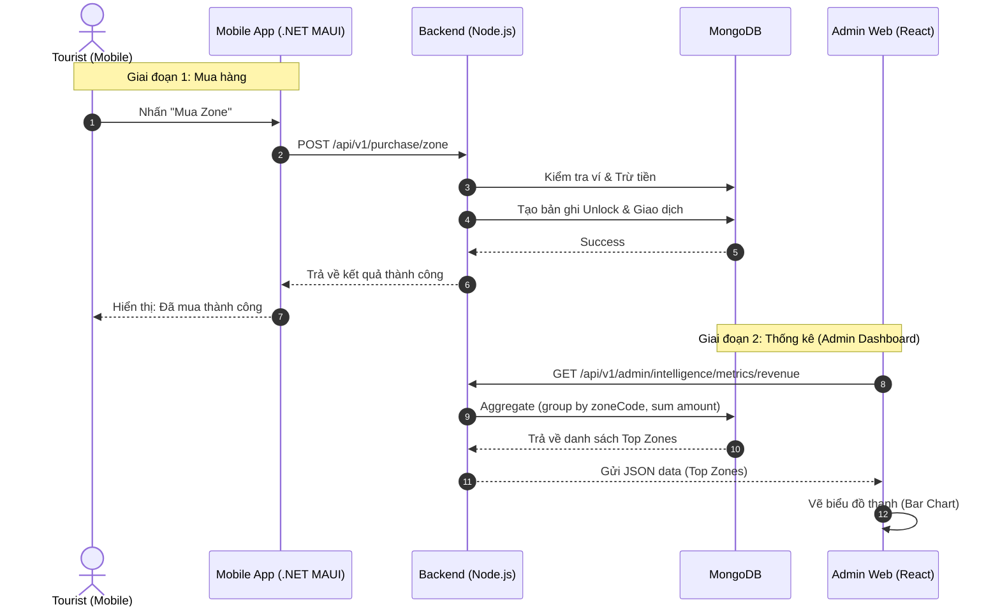

# Top Zones Bestsellers Mermaid Code

Copy đoạn mã dưới đây vào [Mermaid Live Editor](https://mermaid.live/)

```mermaid
sequenceDiagram
    autonumber
    actor User as Tourist (Mobile)
    participant App as Mobile App (.NET MAUI)
    participant API as Backend (Node.js)
    participant DB as MongoDB
    participant Admin as Admin Web (React)

    Note over User, App: Giai đoạn 1: Mua hàng
    User->>App: Nhấn "Mua Zone"
    App->>API: POST /api/v1/purchase/zone
    API->>DB: Kiểm tra ví & Trừ tiền
    API->>DB: Tạo bản ghi Unlock & Giao dịch
    DB-->>API: Success
    API-->>App: Trả về kết quả thành công
    App-->>User: Hiển thị: Đã mua thành công

    Note over Admin, DB: Giai đoạn 2: Thống kê (Admin Dashboard)
    Admin->>API: GET /api/v1/admin/intelligence/metrics/revenue
    API->>DB: Aggregate (group by zoneCode, sum amount)
    DB-->>API: Trả về danh sách Top Zones
    API-->>Admin: Gửi JSON data (Top Zones)
    Admin->>Admin: Vẽ biểu đồ thanh (Bar Chart)
```
