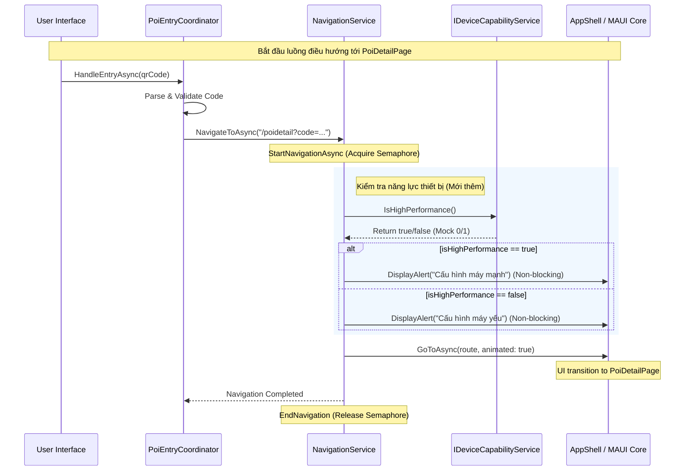

# 🧭 Navigation & Device Capability Sequence Diagram

Tài liệu này mô tả luồng điều hướng (Navigation) kết hợp với kiểm tra cấu hình thiết bị (Device Capability) vừa được triển khai.

---

## 1. Luồng Điều Hướng Chi Tiết POI (End-to-End)

Luồng này bắt đầu từ khi người dùng thực hiện một hành động (Quét QR, Click Map, hoặc Deep Link) dẫn đến việc mở trang chi tiết POI.

---

## 2. Các thành phần tham gia

| Thành phần | Vai trò | Hàm quan trọng |
| :--- | :--- | :--- |
| **PoiEntryCoordinator** | Điểm khởi đầu cho các yêu cầu nhập liệu POI. | `NavigateByCodeAsync` |
| **NavigationService** | Cơ quan điều hướng trung tâm, đảm bảo thread-safe. | `NavigateToAsync` |
| **IDeviceCapabilityService** | Dịch vụ kiểm tra phần cứng (mô phỏng). | `IsHighPerformance` |
| **AppShell / MAUI** | Thực hiện chuyển đổi giao diện thật sự. | `GoToAsync` |

---

## 3. Đặc điểm kỹ thuật

1.  **Tính Không Chặn (Non-blocking):** Việc kiểm tra cấu hình và hiển thị thông báo (Toast/Alert) được thực hiện qua `MainThread.BeginInvokeOnMainThread` mà không có từ khóa `await`, đảm bảo việc chuyển trang diễn ra ngay lập tức.
2.  **Thread Safety:** Sử dụng `SemaphoreSlim` trong `NavigationService` để ngăn chặn việc người dùng bấm nhanh nhiều lần gây ra lỗi chồng lớp (navigation stack crash).
3.  **Khả năng mở rộng:** `IDeviceCapabilityService` được đăng ký qua DI (Dependency Injection), cho phép dễ dàng thay thế bản Mock bằng logic kiểm tra RAM/CPU thật sự trong tương lai.
