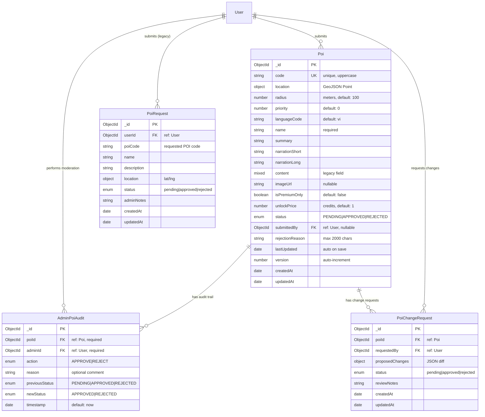
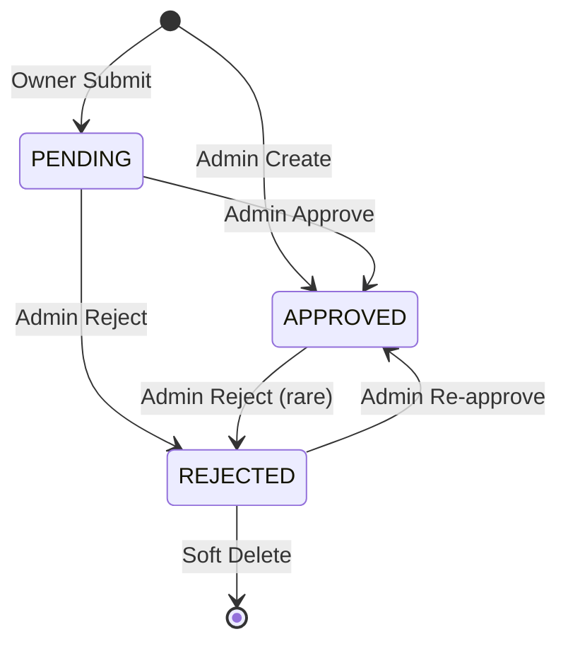

# ERD - POI Core System

**Domain**: POI Core System  
**Subsystem**: Backend (MongoDB) + MAUI (SQLite)  
**Document Version**: 1.0  
**Last Updated**: 2026-05-13

---

## Entity Relationship Diagram



---

## Entity Specifications

### Poi (Backend MongoDB)

**Purpose**: Master POI data with geospatial information, content, and moderation status.

**Schema Location**: `backend/src/models/poi.model.js`

| Field | Type | Constraints | Description |
|-------|------|-------------|-------------|
| _id | ObjectId | PK, Auto | MongoDB primary key |
| code | String | Required, Unique, Uppercase | Stable POI identifier (e.g., "HCM", "HN_OLD_QUARTER") |
| location.type | String | Enum: "Point" | GeoJSON type |
| location.coordinates | [Number] | Required, [lng, lat] | WGS-84 coordinates |
| radius | Number | Required, Default: 100 | Geofence radius in meters |
| priority | Number | Default: 0 | Priority for overlapping geofences (higher wins) |
| languageCode | String | Default: "vi" | Primary language of content |
| name | String | Required | POI display name |
| summary | String | Default: "" | Short description |
| narrationShort | String | Default: "" | Brief audio narration text |
| narrationLong | String | Default: "" | Full audio narration text |
| content | Mixed | Nullable | Legacy field for backward compatibility |
| imageUrl | String | Nullable | Thumbnail image URL |
| isPremiumOnly | Boolean | Default: false | Requires premium subscription |
| unlockPrice | Number | Min: 0, Default: 1 | Credit cost to unlock (0 = free) |
| status | Enum | Default: PENDING | PENDING, APPROVED, REJECTED |
| submittedBy | ObjectId | FK, Nullable | User who submitted (null for admin-created) |
| rejectionReason | String | Max: 2000, Nullable | Admin rejection explanation |
| lastUpdated | Date | Auto | Content modification timestamp |
| version | Number | Default: 1, Auto-increment | Version for sync tracking |
| createdAt | Date | Auto | Creation timestamp |
| updatedAt | Date | Auto | Last modification timestamp |

**Indexes**:
- `code`: Unique index
- `location`: 2dsphere index for geospatial queries
- `code + status`: Composite index for filtered lookups
- `version`: For incremental sync queries

**Pre-Save Hooks**:
1. Auto-increment `version` on content changes
2. Update `lastUpdated` timestamp

**Business Rules**:
1. **Status Transitions**:
   - PENDING → APPROVED (admin only)
   - PENDING → REJECTED (admin only)
   - APPROVED → REJECTED (admin only, rare)
   - REJECTED → APPROVED (admin only, after fixes)
2. **Visibility**: Only APPROVED POIs are visible to public API
3. **Geofence Priority**: Higher priority POI wins when multiple overlap
4. **Version Tracking**: Version increments only on content field changes (not status)

---
### MAUI (SQLite) Database Schema

**Purpose**: Offline-first storage for POIs, translations, zone access, and background sync queues.

**Location**: `Services/PoiDatabase.cs`

#### 1. Table: `pois` (Core POIs)
| Field | Type | Description |
|-------|------|-------------|
| Id | string (PK) | POI Code (e.g. "HCM_01") |
| Code | string | Stable identifier |
| Latitude/Longitude | double | Geospatial coordinates |
| Radius | double | Geofence trigger radius |
| Priority | int | Sorting order for overlapping zones |
| ZoneCode | string | Associated zone identifier |

#### 2. Table: `poi_translation_cache` (Translations)
| Field | Type | Description |
|-------|------|-------------|
| Key | string (PK) | Compound key (code + lang) |
| Content | string | JSON string of localized fields |
| TranslatedAt | DateTime | Cache timestamp |

#### 3. Table: `zone_purchases` (User Access)
| Field | Type | Description |
|-------|------|-------------|
| Id | string (PK) | Unique purchase ID |
| UserId | string | Reference to User |
| ZoneId | string | Reference to Zone |
| IsSynced | int (0|1) | Uploaded to backend? |
| ServerVerified | int (0|1) | Confirmed by backend? |

#### 4. Table: `zone_downloads` (Offline Status)
| Field | Type | Description |
|-------|------|-------------|
| ZoneId | string (PK) | Unique zone identifier |
| IsComplete | int (0|1) | All audio/images downloaded? |

#### 5. Table: `downloaded_audio` (Local Assets)
| Field | Type | Description |
|-------|------|-------------|
| Id | string (PK) | Unique asset ID |
| PoiCode | string | Reference to POI |
| Lang | string | Language code |
| AudioShortPath | string | File path to short audio |
| AudioLongPath | string | File path to long audio |

#### 6. Table: `sync_queue` (Offline Buffer)
| Field | Type | Description |
|-------|------|-------------|
| Id | string (PK) | Unique entry ID |
| Payload | string | JSON of action to sync |
| RetryCount | int | Failed attempt count |

#### 7. Table: `zone_poi_mapping` (Relational)
| Field | Type | Description |
|-------|------|-------------|
| PoiCode | string | Reference to POI |
| ZoneCode | string | Reference to Zone |

### AdminPoiAudit

**Purpose**: Immutable audit trail for all POI moderation actions.

**Schema Location**: `backend/src/models/admin-poi-audit.model.js`

| Field | Type | Constraints | Description |
|-------|------|-------------|-------------|
| _id | ObjectId | PK, Auto | MongoDB primary key |
| poiId | ObjectId | Required, FK | Reference to Poi._id |
| adminId | ObjectId | Required, FK | User who performed action |
| action | Enum | Required | APPROVE or REJECT |
| reason | String | Optional | Admin comment/justification |
| previousStatus | Enum | Required | Status before action |
| newStatus | Enum | Required | Status after action |
| timestamp | Date | Default: now | Action timestamp |

**Indexes**:
- `poiId`: For POI audit history
- `adminId`: For admin activity tracking
- `timestamp`: For chronological queries

**Business Rules**:
1. **Append-Only**: No updates or deletes via API
2. **Atomic Creation**: Must be created in same transaction as Poi status change
3. **Mandatory**: Poi status transition fails if audit creation fails
4. **Populated Queries**: Admin and POI details populated on GET requests

**API Endpoints**:
- `GET /api/v1/admin/pois/audits` - List all audits (paginated, admin-only)
- No POST/PUT/DELETE endpoints (created internally by moderation service)

---

### PoiRequest (Legacy)

**Purpose**: Legacy user-submitted POI requests (pre-Owner workflow).

**Schema Location**: `backend/src/models/poi-request.model.js`

| Field | Type | Constraints | Description |
|-------|------|-------------|-------------|
| _id | ObjectId | PK, Auto | MongoDB primary key |
| userId | ObjectId | Required, FK | User who submitted |
| poiCode | String | Required | Requested POI code |
| name | String | Required | POI name |
| description | String | Optional | POI description |
| location | Object | Required | {lat, lng} |
| status | Enum | Default: "pending" | pending, approved, rejected (lowercase) |
| adminNotes | String | Optional | Admin review notes |
| createdAt | Date | Auto | Submission timestamp |
| updatedAt | Date | Auto | Last update timestamp |

**Status**: ⚠️ **Legacy System** - Replaced by Poi (status=PENDING) workflow

**Business Rules**:
1. Uses lowercase status values (pending/approved/rejected)
2. Does NOT create Poi records automatically
3. Admin must manually migrate approved requests to Poi collection
4. No audit trail (predates AdminPoiAudit)

**Migration Path**: Future versions should consolidate into Poi workflow

---

### PoiChangeRequest

**Purpose**: User-submitted change requests for existing POIs.

**Schema Location**: `backend/src/models/poi-change-request.model.js`

| Field | Type | Constraints | Description |
|-------|------|-------------|-------------|
| _id | ObjectId | PK, Auto | MongoDB primary key |
| poiId | ObjectId | Required, FK | POI to be changed |
| requestedBy | ObjectId | Required, FK | User submitting change |
| proposedChanges | Object | Required | JSON diff of changes |
| status | Enum | Default: "pending" | pending, approved, rejected |
| reviewNotes | String | Optional | Admin review comments |
| createdAt | Date | Auto | Request timestamp |
| updatedAt | Date | Auto | Last update timestamp |

**Status**: ✅ Implemented but not actively used in MVP

---

## Relationships

### User → Poi (1:N)
- **Type**: One-to-Many
- **Cardinality**: One OWNER can submit multiple POIs
- **Enforcement**: Foreign key via Poi.submittedBy
- **Cascade**: User deletion sets submittedBy to null (POI remains)

### Poi → AdminPoiAudit (1:N)
- **Type**: One-to-Many
- **Cardinality**: One POI can have multiple audit records
- **Enforcement**: Foreign key via AdminPoiAudit.poiId
- **Cascade**: POI deletion should cascade delete audits (not implemented)

### User → AdminPoiAudit (1:N)
- **Type**: One-to-Many
- **Cardinality**: One ADMIN can perform multiple moderation actions
- **Enforcement**: Foreign key via AdminPoiAudit.adminId
- **Cascade**: User deletion should preserve audits (historical record)

---

## POI Lifecycle

### State Machine



### Transition Rules

| From | To | Actor | Audit Required | API Endpoint |
|------|-----|-------|----------------|--------------|
| null | PENDING | OWNER | No | POST /api/v1/owner/pois |
| null | APPROVED | ADMIN | No | POST /api/v1/admin/pois |
| PENDING | APPROVED | ADMIN | Yes | POST /api/v1/admin/pois/:id/approve |
| PENDING | REJECTED | ADMIN | Yes | POST /api/v1/admin/pois/:id/reject |
| APPROVED | REJECTED | ADMIN | Yes | POST /api/v1/admin/pois/:id/reject |
| REJECTED | APPROVED | ADMIN | Yes | POST /api/v1/admin/pois/:id/approve |

---

## Visibility Rules

### Public API (GET /api/v1/pois)
- **Visible**: status = APPROVED OR status is null (legacy)
- **Hidden**: status = PENDING or REJECTED

### Admin API (GET /api/v1/admin/pois)
- **Visible**: All POIs regardless of status
- **Filterable**: ?status=PENDING for moderation queue

### MAUI SQLite
- **Seeded**: Only APPROVED POIs from backend
- **Local-Only**: POIs created locally (not synced to backend)

---

## Geospatial Queries

### Nearby POI Search

**Backend Query**:
```javascript
Poi.find({
  location: {
    $near: {
      $geometry: { type: "Point", coordinates: [lng, lat] },
      $maxDistance: radiusInMeters
    }
  },
  status: "APPROVED"
})
```

**MAUI Query**:
```csharp
// In-memory distance calculation (Haversine formula)
var nearby = pois.Where(p => 
  DistanceInMeters(userLat, userLng, p.Latitude, p.Longitude) <= p.Radius
).OrderByDescending(p => p.Priority);
```

---

## Data Synchronization

### Backend → MAUI (Manual)
1. MAUI calls `GET /api/v1/pois?status=APPROVED`
2. Backend returns all approved POIs
3. MAUI clears local SQLite and re-seeds
4. LocalizationService reloads text from JSON

**Issue**: Full refresh only (no incremental sync in MVP)

**Future Enhancement**: Use `version` field for incremental sync
```
GET /api/v1/pois?minVersion=42
```

---

## Content Migration

### Legacy Content Field
- **Old Schema**: Single `content` field (Mixed type) with nested structure
- **New Schema**: Flattened fields (name, summary, narrationShort, narrationLong)
- **Migration**: Backend script consolidates old content into new fields
- **Backward Compatibility**: `content` field kept but not used

---

## Related Documentation

- [User Management ERD](erd_user_auth.md) - User → Poi relationship
- [POI Localization ERD](erd_poi_localization.md) - Multi-language content
- [Backend Admin Flow](../../05-admin-flow.md) - Moderation workflow details
- [Backend POI Lifecycle](../../06-poi-lifecycle.md) - Status transition rules
