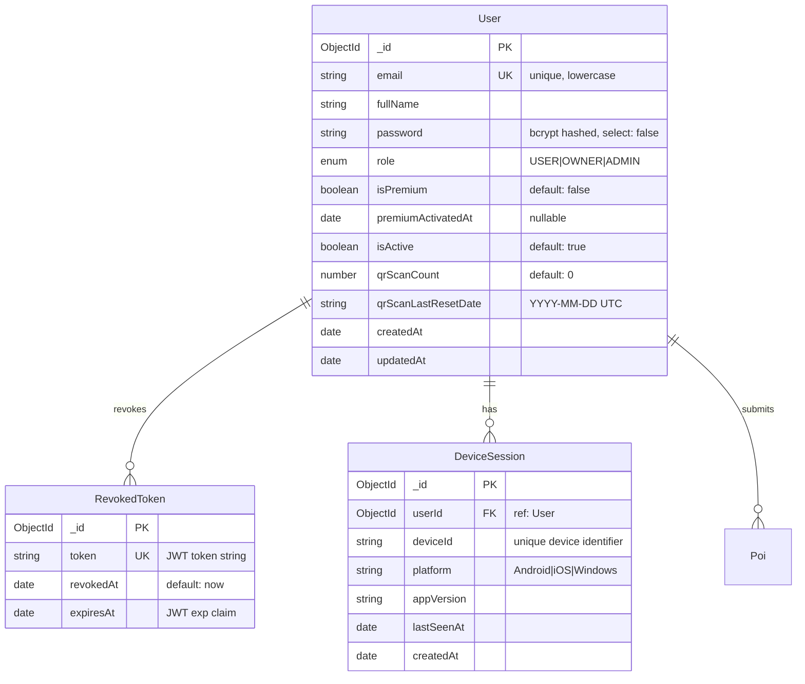

# ERD - User Management & Authentication

**Domain**: User Management & Authentication  
**Subsystem**: Backend (MongoDB)  
**Document Version**: 1.0  
**Last Updated**: 2026-05-13

---

## Entity Relationship Diagram



---

## Entity Specifications

### User

**Purpose**: Core user account entity supporting authentication, authorization, and subscription management.

**Schema Location**: `backend/src/models/user.model.js`

| Field | Type | Constraints | Description |
|-------|------|-------------|-------------|
| _id | ObjectId | PK, Auto | MongoDB primary key |
| email | String | Required, Unique, Lowercase | User email for login |
| fullName | String | Optional, Default: "" | Display name |
| password | String | Required, Select: false | Bcrypt hashed (12 rounds) |
| role | Enum | Required, Default: USER | RBAC role (USER, OWNER, ADMIN) |
| isPremium | Boolean | Default: false | Premium subscription status |
| premiumActivatedAt | Date | Nullable | Timestamp when premium was activated |
| isActive | Boolean | Default: true | Account active status (soft delete) |
| qrScanCount | Number | Min: 0, Default: 0 | Daily QR scan counter (free tier limit) |
| qrScanLastResetDate | String | Nullable | Last reset date in YYYY-MM-DD UTC format |
| createdAt | Date | Auto | Account creation timestamp |
| updatedAt | Date | Auto | Last modification timestamp |

**Indexes**:
- `email`: Unique index for login lookups
- `role`: For admin user queries
- `isPremium`: For subscription analytics

**Business Rules**:
1. Password must be hashed before save (pre-save hook)
2. Email is case-insensitive (stored lowercase)
3. Role cannot be changed by user (admin-only operation)
4. isPremium is NOT used for authorization (only feature gating)
5. qrScanCount resets daily at UTC midnight

**Methods**:
- `comparePassword(candidatePassword, userPassword)`: Async bcrypt comparison

---

### RevokedToken

**Purpose**: JWT token blacklist for logout and security revocation.

**Schema Location**: `backend/src/models/revoked-token.model.js`

| Field | Type | Constraints | Description |
|-------|------|-------------|-------------|
| _id | ObjectId | PK, Auto | MongoDB primary key |
| token | String | Required, Unique | Full JWT token string |
| revokedAt | Date | Default: now | Revocation timestamp |
| expiresAt | Date | Required | JWT expiration (from exp claim) |

**Indexes**:
- `token`: Unique index for fast blacklist checks
- `expiresAt`: TTL index for automatic cleanup

**Business Rules**:
1. Token is checked on every protected route via `protect` middleware
2. Expired tokens are automatically removed by MongoDB TTL index
3. Revocation is permanent (no un-revoke)

**Usage Flow**:
```
User Logout → POST /api/v1/auth/logout → Insert token into RevokedToken → Future requests with this token are rejected
```

---

### DeviceSession

**Purpose**: Track user devices for analytics and multi-device management.

**Schema Location**: `backend/src/models/device-session.model.js`

| Field | Type | Constraints | Description |
|-------|------|-------------|-------------|
| _id | ObjectId | PK, Auto | MongoDB primary key |
| userId | ObjectId | Required, FK | Reference to User._id |
| deviceId | String | Required | Unique device identifier (from MAUI) |
| platform | String | Required | Android, iOS, Windows |
| appVersion | String | Optional | MAUI app version string |
| lastSeenAt | Date | Default: now | Last activity timestamp |
| createdAt | Date | Auto | First seen timestamp |

**Indexes**:
- `userId`: For user device queries
- `deviceId`: For device lookup
- `lastSeenAt`: For inactive device cleanup

**Business Rules**:
1. One user can have multiple devices
2. Device sessions are updated on each API call (lastSeenAt)
3. Inactive sessions (>90 days) may be archived

---

## Relationships

### User → RevokedToken (1:N)
- **Type**: One-to-Many
- **Cardinality**: One user can revoke multiple tokens (logout from multiple devices)
- **Enforcement**: Application-level (no FK constraint in MongoDB)
- **Cascade**: Tokens are independent; user deletion does NOT cascade to RevokedToken

### User → DeviceSession (1:N)
- **Type**: One-to-Many
- **Cardinality**: One user can have multiple active device sessions
- **Enforcement**: Foreign key via userId (ObjectId reference)
- **Cascade**: User deletion SHOULD cascade delete device sessions (not implemented in MVP)

### User → Poi (1:N)
- **Type**: One-to-Many (cross-domain)
- **Cardinality**: One user (OWNER role) can submit multiple POIs
- **Enforcement**: Foreign key via Poi.submittedBy (ObjectId reference)
- **Cascade**: User deletion does NOT cascade to POI (POI remains with null submittedBy)

---

## Authentication Flow

### Registration
```
POST /api/v1/auth/register
→ Validate email uniqueness
→ Hash password (bcrypt, 12 rounds)
→ Create User (role=USER, isPremium=false)
→ Generate JWT
→ Return { success: true, data: { token, user } }
```

### Login
```
POST /api/v1/auth/login
→ Find User by email (include password field)
→ Compare password (bcrypt)
→ Check isActive=true
→ Generate JWT (payload: { id, email, role })
→ Update/Create DeviceSession
→ Return { success: true, data: { token, user } }
```

### Logout
```
POST /api/v1/auth/logout
→ Extract JWT from Authorization header
→ Insert token into RevokedToken
→ Return { success: true }
```

### Token Validation (Middleware)
```
protect middleware:
→ Extract JWT from Authorization: Bearer <token>
→ Check if token in RevokedToken collection
→ Verify JWT signature (JWT_SECRET)
→ Check expiration
→ Attach req.user = decoded payload
→ Continue to route handler
```

---

## Authorization (RBAC)

### Role Hierarchy
```
ADMIN > OWNER > USER
```

### Role Permissions

| Role | Permissions |
|------|-------------|
| USER | View approved POIs, QR scan (limited), purchase zones |
| OWNER | All USER permissions + Submit POIs (PENDING status) |
| ADMIN | All OWNER permissions + Approve/Reject POIs, User management, View analytics |

### Middleware Enforcement
- `requireRole(['ADMIN'])`: Admin-only routes
- `requireRole(['OWNER', 'ADMIN'])`: Owner and Admin routes
- `protect`: Any authenticated user

**Implementation**: `backend/src/middlewares/rbac.middleware.js`

---

## Subscription & Feature Gating

### Premium Status
- **Field**: `User.isPremium` (boolean)
- **Purpose**: Feature gating, NOT authorization
- **Enforcement**: `requirePremium` middleware checks `req.user.isPremium`

### Feature Gates

| Feature | Free Tier | Premium Tier |
|---------|-----------|--------------|
| QR Scans | 5 per day | Unlimited |
| POI Access | Public POIs only | All POIs including premium |
| Audio Downloads | Streaming only | Offline downloads |
| Zone Access | Purchase required | Included in subscription |

**Implementation**: `backend/src/middlewares/subscription.middleware.js`

---

## Security Considerations

### Password Security
- **Hashing**: Bcrypt with 12 rounds (pre-save hook)
- **Storage**: Password field has `select: false` (excluded from queries by default)
- **Validation**: Minimum length enforced at application layer (not in schema)

### JWT Security
- **Algorithm**: HS256 (HMAC SHA-256)
- **Secret**: Environment variable `JWT_SECRET` (must be strong)
- **Expiration**: Configurable (default: 7 days)
- **Revocation**: Token blacklist via RevokedToken collection

### Rate Limiting
- **Endpoint**: `/api/v1/auth/login` has stricter rate limit
- **Implementation**: In-memory rate limiter (not persistent across restarts)

---

## Data Migration Notes

### Legacy Fields
- None identified in current schema

### Future Enhancements
1. **Email Verification**: Add `emailVerified` boolean and `verificationToken` fields
2. **Password Reset**: Add `resetPasswordToken` and `resetPasswordExpires` fields
3. **Multi-Factor Auth**: Add `mfaEnabled` and `mfaSecret` fields
4. **OAuth Integration**: Add `oauthProvider` and `oauthId` fields

---

## Related Documentation

- [POI Core System ERD](erd_poi_core.md) - User → Poi relationship
- [Zone & Subscription ERD](erd_zone_subscription.md) - Premium subscription details
- [Backend Auth Flow](../../02-auth-rbac.md) - Detailed authentication documentation
