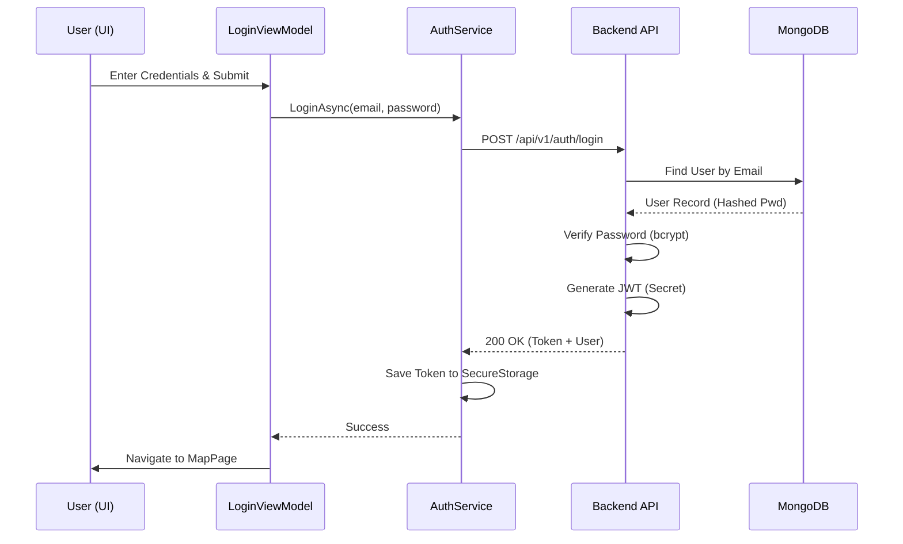

# SEQ01 - User Login Sequence

Detailed technical interaction for logging in.

```mermaid
sequenceDiagram
    participant U as User (UI)
    participant VM as LoginViewModel
    participant S as AuthService
    participant B as Backend API
    participant DB as MongoDB

    U->>VM: Enter Credentials & Submit
    VM->>S: LoginAsync(email, password)
    S->>B: POST /api/v1/auth/login
    B->>DB: Find User by Email
    DB-->>B: User Record (Hashed Pwd)
    B->>B: Verify Password (bcrypt)
    B->>B: Generate JWT (Secret)
    B-->>S: 200 OK (Token + User)
    S->>S: Save Token to SecureStorage
    S-->>VM: Success
    VM->>U: Navigate to MapPage
```
