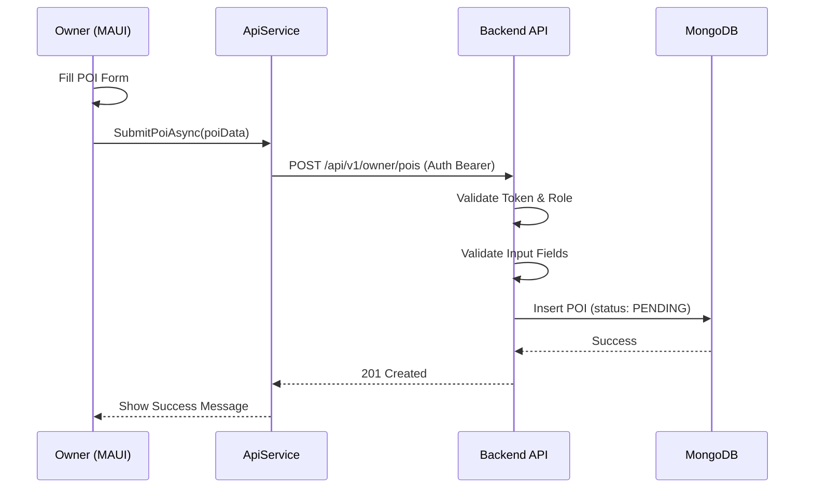

# SEQ02 - POI Submission Sequence

Interaction flow for an Owner submitting a new POI.

```mermaid
sequenceDiagram
    participant O as Owner (MAUI)
    participant S as ApiService
    participant B as Backend API
    participant DB as MongoDB

    O->>O: Fill POI Form
    O->>S: SubmitPoiAsync(poiData)
    S->>B: POST /api/v1/owner/pois (Auth Bearer)
    B->>B: Validate Token & Role
    B->>B: Validate Input Fields
    B->>DB: Insert POI (status: PENDING)
    DB-->>B: Success
    B-->>S: 201 Created
    S-->>O: Show Success Message
```
