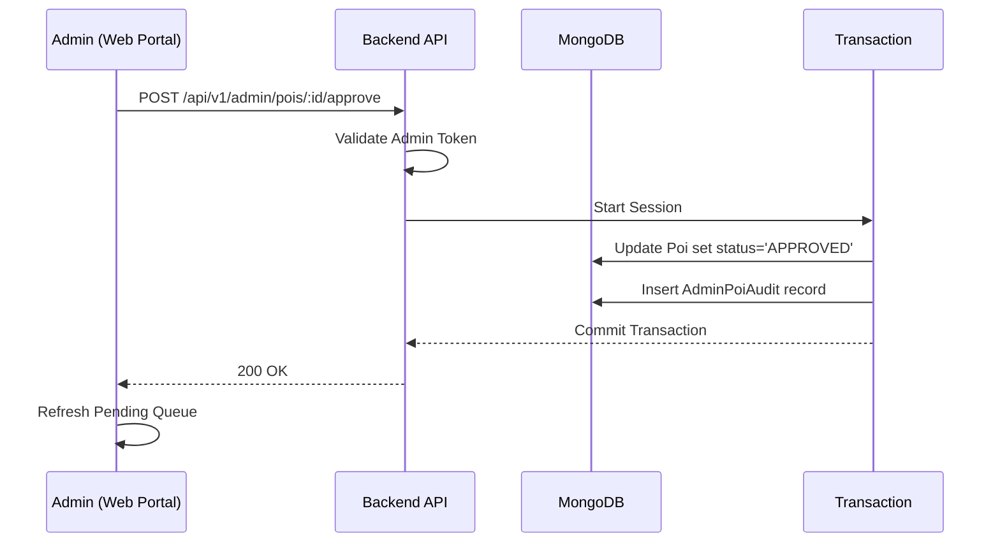

# SEQ03 - POI Moderation Sequence

Interaction flow for an Admin approving a POI.

```mermaid
sequenceDiagram
    participant A as Admin (Web Portal)
    participant B as Backend API
    participant DB as MongoDB
    participant T as Transaction

    A->>B: POST /api/v1/admin/pois/:id/approve
    B->>B: Validate Admin Token
    B->>T: Start Session
    T->>DB: Update Poi set status='APPROVED'
    T->>DB: Insert AdminPoiAudit record
    T-->>B: Commit Transaction
    B-->>A: 200 OK
    A->>A: Refresh Pending Queue
```
