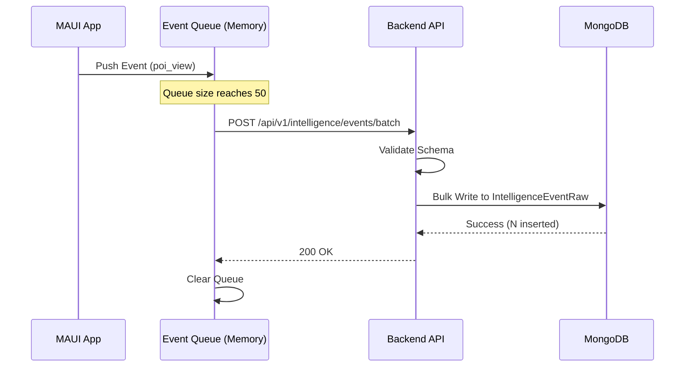

# SEQ04 - Analytics Event Ingestion Sequence

Technical flow for batch event processing.

```mermaid
sequenceDiagram
    participant M as MAUI App
    participant Q as Event Queue (Memory)
    participant B as Backend API
    participant DB as MongoDB

    M->>Q: Push Event (poi_view)
    Note over Q: Queue size reaches 50
    Q->>B: POST /api/v1/intelligence/events/batch
    B->>B: Validate Schema
    B->>DB: Bulk Write to IntelligenceEventRaw
    DB-->>B: Success (N inserted)
    B-->>Q: 200 OK
    Q->>Q: Clear Queue
```
