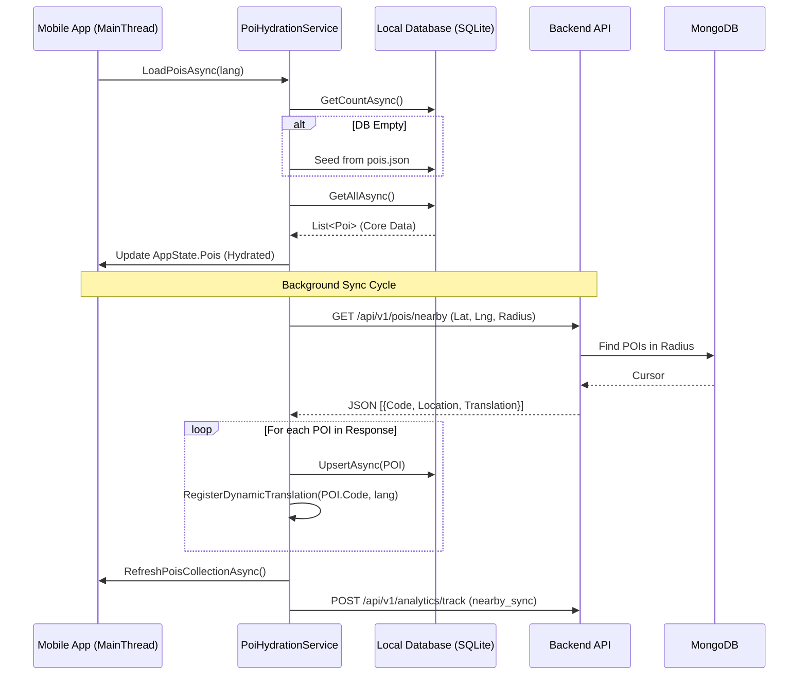

# SEQ - Offline Data Hydration Sequence

Detailed technical flow of the `PoiHydrationService` during app startup and background sync.

```mermaid
sequenceDiagram
    participant App as Mobile App (MainThread)
    participant Hydrator as PoiHydrationService
    participant SQLite as Local Database (SQLite)
    participant API as Backend API
    participant DB as MongoDB

    App->>Hydrator: LoadPoisAsync(lang)
    Hydrator->>SQLite: GetCountAsync()
    alt DB Empty
        Hydrator->>SQLite: Seed from pois.json
    end
    Hydrator->>SQLite: GetAllAsync()
    SQLite-->>Hydrator: List<Poi> (Core Data)
    Hydrator->>App: Update AppState.Pois (Hydrated)

    Note over App, API: Background Sync Cycle
    Hydrator->>API: GET /api/v1/pois/nearby (Lat, Lng, Radius)
    API->>DB: Find POIs in Radius
    DB-->>API: Cursor
    API-->>Hydrator: JSON [{Code, Location, Translation}]
    
    loop For each POI in Response
        Hydrator->>SQLite: UpsertAsync(POI)
        Hydrator->>Hydrator: RegisterDynamicTranslation(POI.Code, lang)
    end
    
    Hydrator->>App: RefreshPoisCollectionAsync()
    Hydrator->>API: POST /api/v1/analytics/track (nearby_sync)
```
