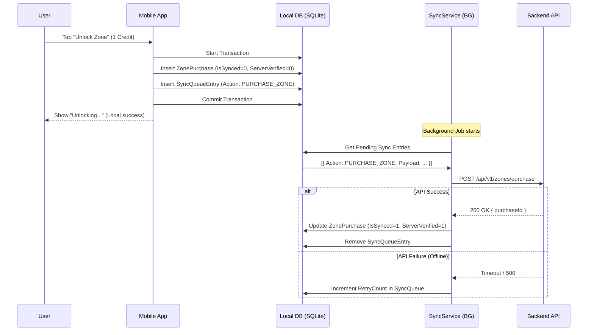

# SEQ - Offline Purchase & Sync Logic

This diagram shows how the app handles a zone purchase when the connection might be unstable.

```mermaid
sequenceDiagram
    participant User
    participant App as Mobile App
    participant SQLite as Local DB (SQLite)
    participant Sync as SyncService (BG)
    participant API as Backend API

    User->>App: Tap "Unlock Zone" (1 Credit)
    App->>SQLite: Start Transaction
    App->>SQLite: Insert ZonePurchase (IsSynced=0, ServerVerified=0)
    App->>SQLite: Insert SyncQueueEntry (Action: PURCHASE_ZONE)
    App->>SQLite: Commit Transaction
    App-->>User: Show "Unlocking..." (Local success)
    
    Note over Sync: Background Job starts
    Sync->>SQLite: Get Pending Sync Entries
    SQLite-->>Sync: [{ Action: PURCHASE_ZONE, Payload: ... }]
    
    Sync->>API: POST /api/v1/zones/purchase
    alt API Success
        API-->>Sync: 200 OK { purchaseId }
        Sync->>SQLite: Update ZonePurchase (IsSynced=1, ServerVerified=1)
        Sync->>SQLite: Remove SyncQueueEntry
    else API Failure (Offline)
        API-->>Sync: Timeout / 500
        Sync->>SQLite: Increment RetryCount in SyncQueue
    end
```
