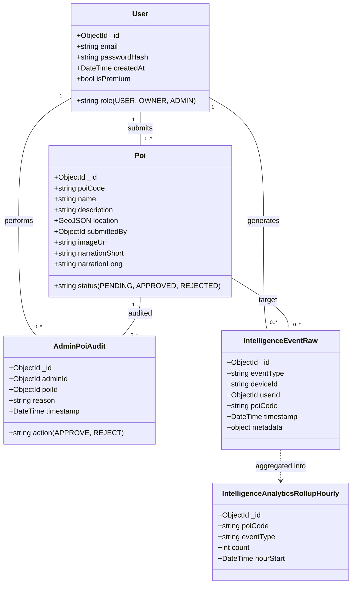

# CLASS01 - System Entity Models

This diagram represents the core data entities and their relationships within the VN-GO Travel system.

```mermaid
classDiagram
    class User {
        +ObjectId _id
        +string email
        +string passwordHash
        +string role (USER, OWNER, ADMIN)
        +DateTime createdAt
        +bool isPremium
    }

    class Poi {
        +ObjectId _id
        +string poiCode
        +string name
        +string description
        +GeoJSON location
        +string status (PENDING, APPROVED, REJECTED)
        +ObjectId submittedBy
        +string imageUrl
        +string narrationShort
        +string narrationLong
    }

    class AdminPoiAudit {
        +ObjectId _id
        +ObjectId adminId
        +ObjectId poiId
        +string action (APPROVE, REJECT)
        +string reason
        +DateTime timestamp
    }

    class IntelligenceEventRaw {
        +ObjectId _id
        +string eventType
        +string deviceId
        +ObjectId userId
        +string poiCode
        +DateTime timestamp
        +object metadata
    }

    class IntelligenceAnalyticsRollupHourly {
        +ObjectId _id
        +string poiCode
        +string eventType
        +int count
        +DateTime hourStart
    }

    User "1" -- "0..*" Poi : submits
    User "1" -- "0..*" AdminPoiAudit : performs
    Poi "1" -- "0..*" AdminPoiAudit : audited
    User "1" -- "0..*" IntelligenceEventRaw : generates
    Poi "1" -- "0..*" IntelligenceEventRaw : target
    IntelligenceEventRaw ..> IntelligenceAnalyticsRollupHourly : aggregated into
```
