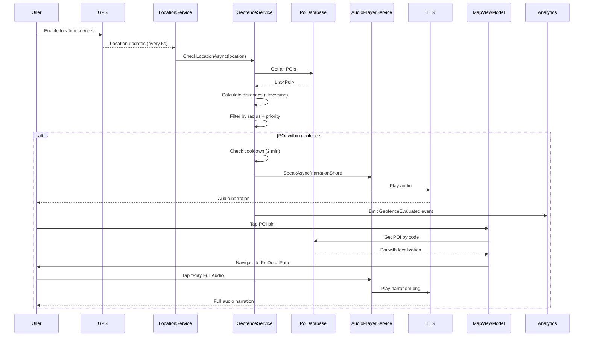
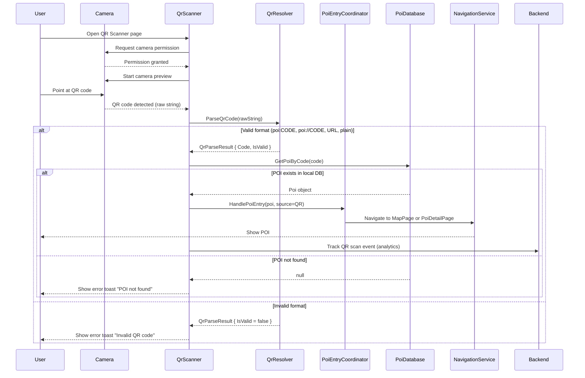
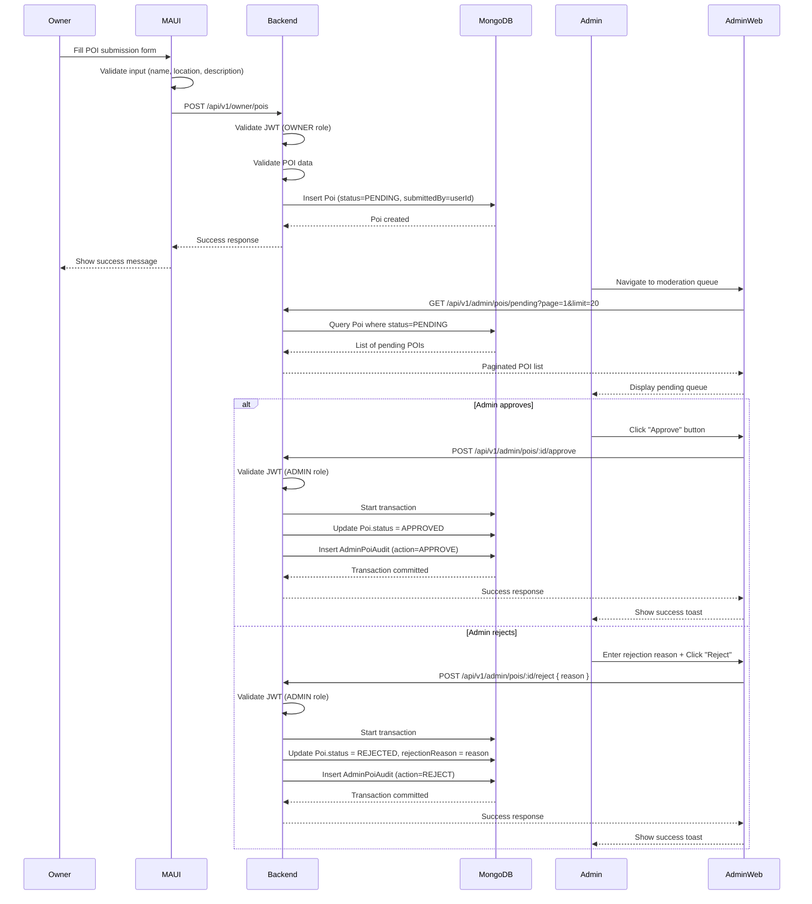
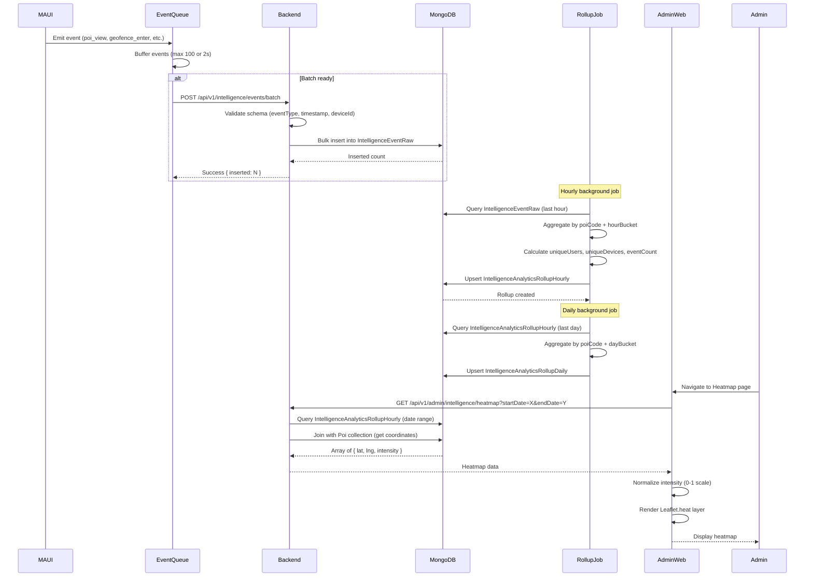
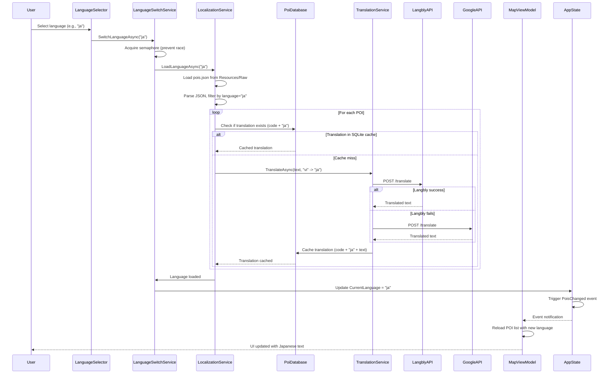
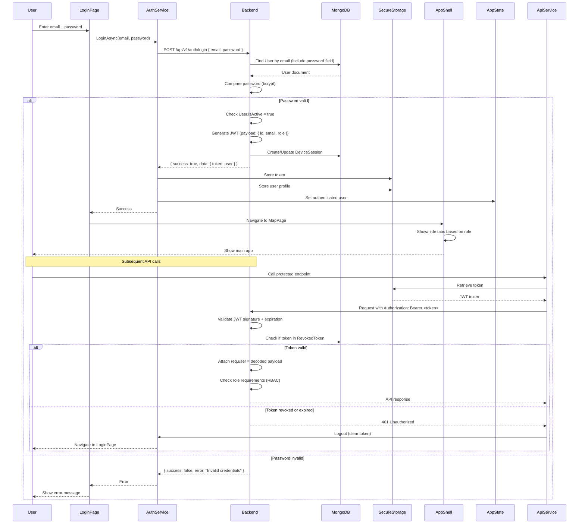
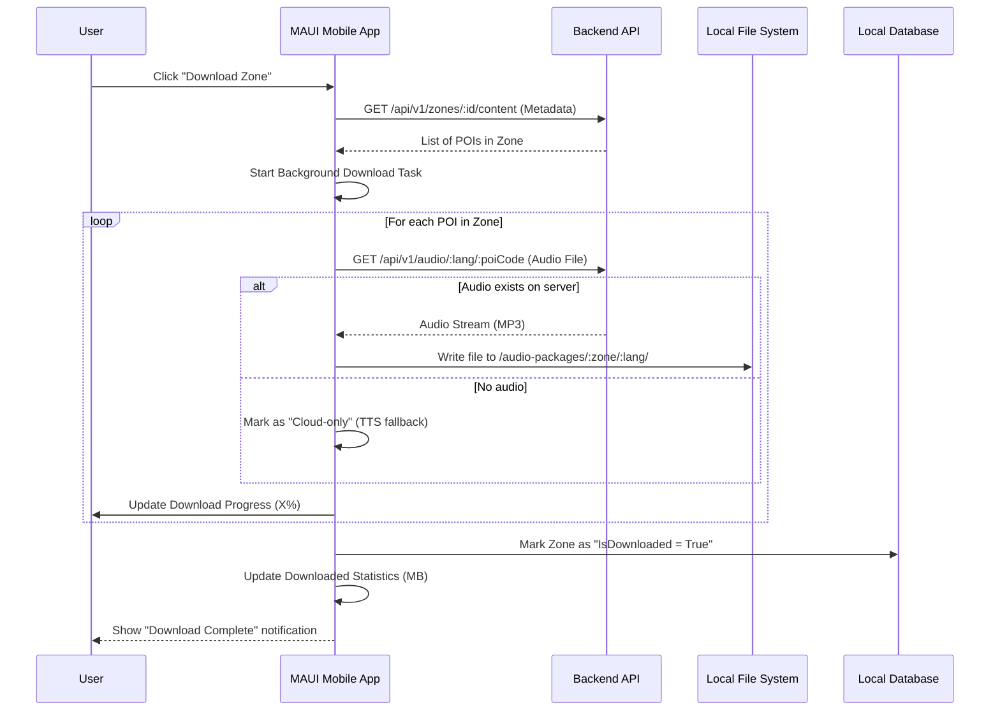

# 07 - System Flows

**Document Version**: 1.0  
**Last Updated**: 2026-05-13

---

## Purpose

This document describes **cross-system workflows** that span multiple subsystems (MAUI, Backend, Admin Web). These flows show how components interact to deliver end-to-end features.

---

## Flow 1: End-to-End POI Discovery and Audio Playback

### Overview
User discovers a POI via geofencing, hears automatic narration, then views details and plays full audio.

### Participating Systems
- MAUI Mobile App (LocationService, GeofenceService, AudioPlayerService, MapViewModel, PoiDetailViewModel)
- Backend API (optional, for analytics)
- Platform Services (GPS, TTS)

### Flow Diagram

### Key Decision Points
1. **Geofence Trigger**: Distance <= radius AND priority highest AND cooldown expired
2. **Audio Suppression**: Skip if POI already selected in UI
3. **Language Selection**: Use AppState.CurrentLanguage for TTS

### Error Handling
- GPS unavailable: Show error toast, disable geofencing
- TTS engine unavailable: Silent failure, log error
- POI not found: Show "POI not available" message

---

## Flow 2: QR Code to POI Navigation

### Overview
User scans physical QR code at POI location, app parses code and navigates to POI on map or detail page.

### Participating Systems
- MAUI Mobile App (QrScannerViewModel, PoiEntryCoordinator, NavigationService, PoiDatabase)
- Backend API (optional, for scan tracking)

### Flow Diagram

### QR Code Format Support
1. **URI Scheme**: `poi:HCM`, `poi://HN_OLD_QUARTER`
2. **Web URL**: `https://vngo.travel/poi/HCM`, `https://vngo.travel/p/HCM`
3. **Plain Code**: `HCM` (uppercase alphanumeric)

### Key Decision Points
1. **Navigation Mode**: Map-first (show on map) vs Detail-first (show detail page)
2. **Scan Limit Check**: Free tier limited to 5 scans/day (client-side enforcement)
3. **Offline Behavior**: Works fully offline if POI in local DB

### Error Handling
- Camera permission denied: Show permission request dialog
- Invalid QR format: Show user-friendly error message
- POI not in local DB: Suggest manual search or refresh data

---

## Flow 3: Owner POI Submission to Admin Approval

### Overview
Owner submits new POI via MAUI app, admin reviews in web portal, approval/rejection syncs back to backend.

### Participating Systems
- MAUI Mobile App (Owner submission UI - partial)
- Backend API (Owner controller, POI service, Audit service)
- Admin Web Portal (Moderation queue, Approval UI)
- MongoDB (Poi collection, AdminPoiAudit collection)

### Flow Diagram

### Key Decision Points
1. **Auto-Approval**: Admin-created POIs are APPROVED immediately (bypass moderation)
2. **Audit Atomicity**: Status change and audit log creation must be atomic (transaction)
3. **Notification**: Owner not notified of approval/rejection in MVP (future enhancement)

### Error Handling
- Invalid POI data: Return 400 with validation errors
- Duplicate POI code: Return 409 conflict
- Audit creation fails: Rollback status change, return 500
- Transaction timeout: Retry once, then fail

---

## Flow 4: Analytics Event Pipeline to Heatmap

### Overview
MAUI app generates events, batches them to backend, background jobs aggregate to rollup tables, admin views heatmap.

### Participating Systems
- MAUI Mobile App (RbelBackgroundDispatcher, RuntimeTelemetry)
- Backend API (Intelligence controller, Event models, Rollup jobs)
- Admin Web Portal (Heatmap page, Leaflet.heat)
- MongoDB (IntelligenceEventRaw, Rollup collections)

### Flow Diagram

### Key Decision Points
1. **Batch Size**: Max 100 events or 2 seconds (whichever comes first)
2. **Rollup Frequency**: Hourly for recent data, daily for historical trends
3. **Data Retention**: Raw events 90 days, hourly rollups 30 days, daily rollups indefinite
4. **Heatmap Intensity**: Normalized by max event count in dataset

### Error Handling
- Batch ingestion fails: Events dropped (no retry in MVP)
- Rollup job fails: Retry on next scheduled run
- Heatmap query timeout: Return cached data or error

---

## Flow 5: Multi-Language Content Resolution

### Overview
User switches language, app checks local cache, falls back to translation API, caches result, updates UI.

### Participating Systems
- MAUI Mobile App (LanguageSwitchService, LocalizationService, PoiTranslationService, PoiDatabase)
- Translation APIs (Langbly, Google Translate)

### Flow Diagram

### Key Decision Points
1. **Fallback Chain**: pois.json → SQLite cache → Langbly API → Google Translate API → Vietnamese fallback
2. **Cache Strategy**: Permanent cache (no expiration in MVP)
3. **Concurrency Control**: Semaphore prevents multiple simultaneous language switches
4. **UI Blocking**: Language switch takes 5-10 seconds (acceptable for MVP)

### Error Handling
- All translation APIs fail: Fall back to Vietnamese (primary language)
- JSON parse error: Log error, use empty localization
- SQLite error: Continue without cache, log error

---

## Flow 6: User Authentication and Role-Based Access

### Overview
User logs in via MAUI app, backend validates credentials, issues JWT, MAUI stores token and uses for subsequent API calls.

### Participating Systems
- MAUI Mobile App (LoginViewModel, AuthService, ApiService, SecureStorage)
- Backend API (Auth controller, User model, JWT service)
- MongoDB (User collection, RevokedToken collection)

### Flow Diagram

### Key Decision Points
1. **Token Storage**: SecureStorage (encrypted on device)
2. **Token Expiration**: 7 days (configurable)
3. **Auto-Logout**: On 401 response, clear token and redirect to login
4. **Role-Based UI**: Shell tabs visibility controlled by user role

### Error Handling
- Network error: Show "Cannot connect to server" message
- Invalid credentials: Show "Email or password incorrect"
- Token expired: Auto-logout and redirect to login
- SecureStorage error: Fall back to in-memory storage (session only)

---

## Cross-System Integration Points

### MAUI ↔ Backend API

| Integration Point | Protocol | Authentication | Error Handling |
|-------------------|----------|----------------|----------------|
| POI Sync | REST (GET /api/v1/pois) | Optional (public POIs) | Offline fallback to local DB |
| User Auth | REST (POST /api/v1/auth/login) | None (login endpoint) | Show error message |
| Analytics Events | REST (POST /api/v1/intelligence/events/batch) | Bearer token or X-Api-Key | Drop events on failure |
| Owner Submission | REST (POST /api/v1/owner/pois) | Bearer token (OWNER role) | Show validation errors |

### Backend API ↔ MongoDB

| Integration Point | Pattern | Consistency | Error Handling |
|-------------------|---------|-------------|----------------|
| POI CRUD | Repository pattern | Strong (transactions for moderation) | Rollback on error |
| Analytics Ingestion | Bulk insert | Eventual (no transactions) | Log error, continue |
| User Management | Repository pattern | Strong | Return error to client |

### Admin Web ↔ Backend API

| Integration Point | Protocol | Authentication | Error Handling |
|-------------------|----------|----------------|----------------|
| Moderation Queue | REST (GET /api/v1/admin/pois/pending) | Bearer token (ADMIN role) | Show error toast |
| Approve/Reject | REST (POST /api/v1/admin/pois/:id/approve) | Bearer token (ADMIN role) | Show error, refresh queue |
| Heatmap Data | REST (GET /api/v1/admin/intelligence/heatmap) | Bearer token (ADMIN role) | Show cached data or error |

---

## Performance Considerations

### Flow 1 (Geofencing)
- **Bottleneck**: GPS polling every 5 seconds
- **Optimization**: Increase interval to 10s, reduce battery drain
- **Trade-off**: Increased latency for geofence triggers

### Flow 4 (Analytics Pipeline)
- **Bottleneck**: Heatmap query with >1000 POIs
- **Optimization**: Pre-aggregate data, use spatial clustering
- **Trade-off**: Reduced granularity

### Flow 5 (Translation)
- **Bottleneck**: Translation API latency (500-2000ms)
- **Optimization**: Aggressive caching, preload popular POIs
- **Trade-off**: Stale translations

---

---

## Flow 7: Offline Content Download & Management

### Overview
User purchases a zone, downloads the full content (metadata + audio) for offline use, and manages local storage.

### Participating Systems
- MAUI Mobile App (AudioDownloadService, ZoneDownloadService, PoiDatabase, AppState)
- Backend API (Zones controller, Audio assets)
- File System (AppDataDirectory/audio-packages)

### Flow Diagram

### Storage Organization
- **Base Path**: `AppData/audio-packages/`
- **Structure**: `[ZONE_CODE]/[LANG_CODE]/[POI_CODE]/[short|long].mp3`
- **Fallback**: If local file missing, app attempts real-time streaming or TTS.

---

## Related Documentation

- [Sequence Diagrams](../05_sequence/) - Detailed technical flows
- [Activity Diagrams](../04_activity/) - Business logic decision trees
- [Feature Breakdown](../08_feature_vs_task_breakdown.md) - Feature-to-task mapping
- [Known Issues](../09_known_issues_and_tech_debt.md) - Flow-related issues
