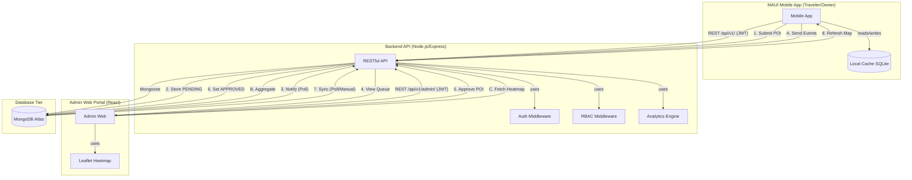

# 01 - System Communication Architecture

This document describes the high-level communication architecture between the MAUI Mobile App, the Backend API, and the Admin Web Portal.

## Overview

The system follows a hub-and-spoke model where the **Backend API** acts as the central coordinator. The **Mobile App** (for Travelers/Owners) and the **Web Portal** (for Admins) communicate exclusively through the Backend.

## Communication Components

### 1. The Gateway (Backend API)
- All requests are stateless and secured via **JWT (JSON Web Tokens)**.
- **RBAC (Role-Based Access Control)** ensures that only users with the `ADMIN` role can access the `/api/v1/admin/*` endpoints.

### 2. Mobile-to-Web Interaction (Async)
There is no direct connection between the Mobile App and the Admin Web. Interaction is asynchronous and mediated by the database:
- **Content Creation**: A user submits content via the App. It enters a "Pending" state in the database. The Admin Web later retrieves this state for review.
- **Status Updates**: Once an Admin approves content, the state in the database changes. The App will reflect this change during its next synchronization or manual refresh.

### 3. Analytics Pipeline
- The **Mobile App** is the primary source of behavioral data (events).
- The **Backend** processes and aggregates this data.
- The **Admin Web** provides the interface to visualize this data (heatmaps, metrics).
