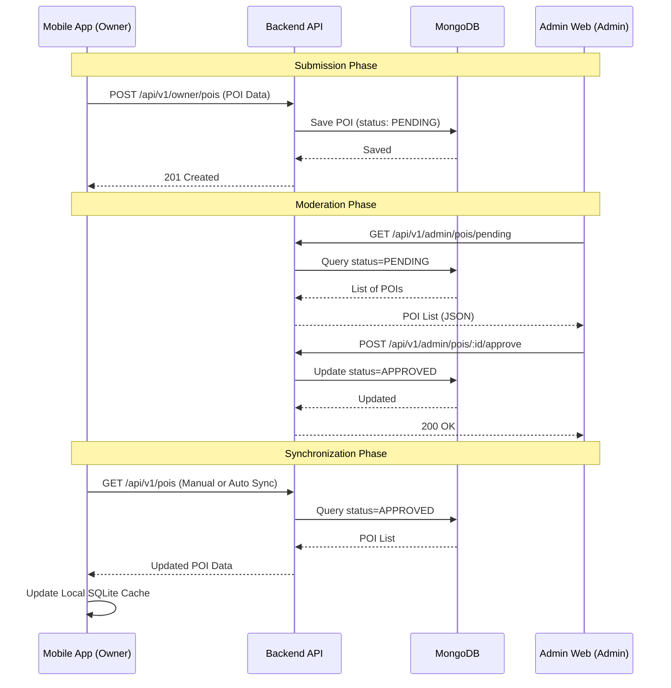
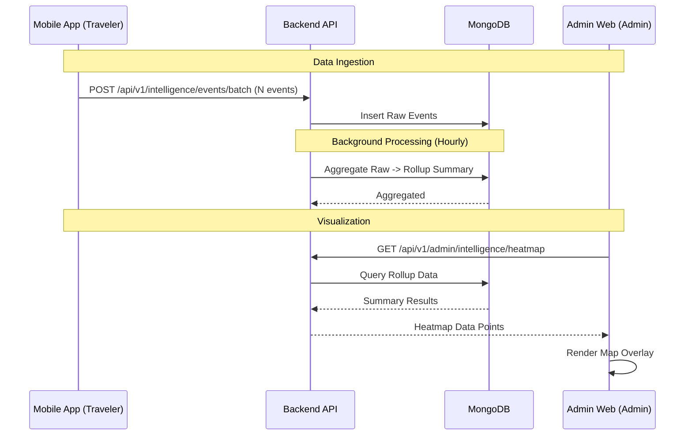

# SEQ - Cross-Platform Communication Flow

This diagram visualizes how the Mobile App and Admin Web interact through the Backend API for two core scenarios: **POI Submission/Approval** and **Analytics Loop**.

## 1. POI Content Lifecycle (App to Web)

## 2. Behavioral Analytics Loop (App to Web)

