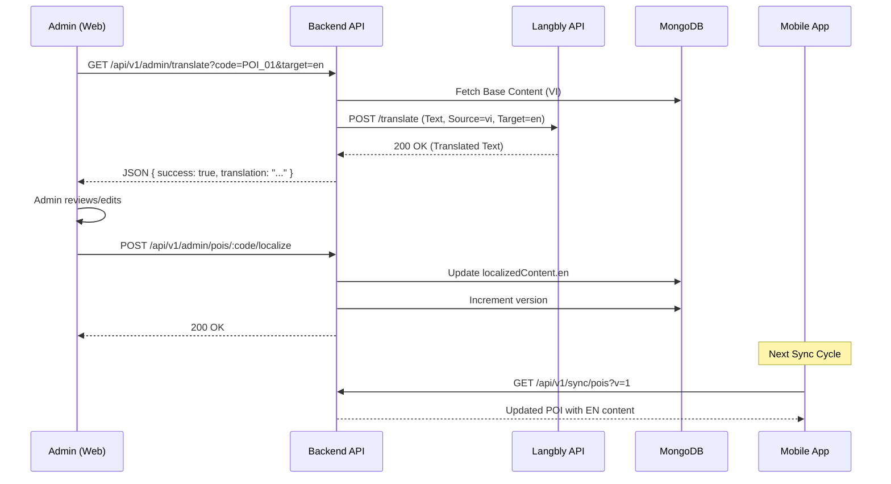

# SEQ - Multi-Language Translation Sequence

Detailed technical interaction for generating and saving translations.

```mermaid
sequenceDiagram
    participant A as Admin (Web)
    participant B as Backend API
    participant L as Langbly API
    participant DB as MongoDB
    participant App as Mobile App

    A->>B: GET /api/v1/admin/translate?code=POI_01&target=en
    B->>DB: Fetch Base Content (VI)
    B->>L: POST /translate (Text, Source=vi, Target=en)
    L-->>B: 200 OK (Translated Text)
    B-->>A: JSON { success: true, translation: "..." }
    
    A->>A: Admin reviews/edits
    A->>B: POST /api/v1/admin/pois/:code/localize
    B->>DB: Update localizedContent.en
    B->>DB: Increment version
    B-->>A: 200 OK
    
    Note over App: Next Sync Cycle
    App->>B: GET /api/v1/sync/pois?v=1
    B-->>App: Updated POI with EN content
```
